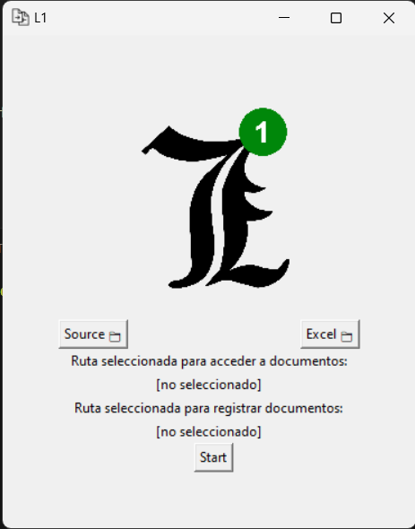
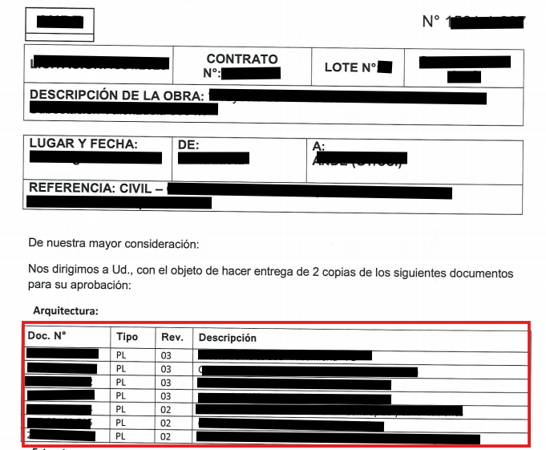
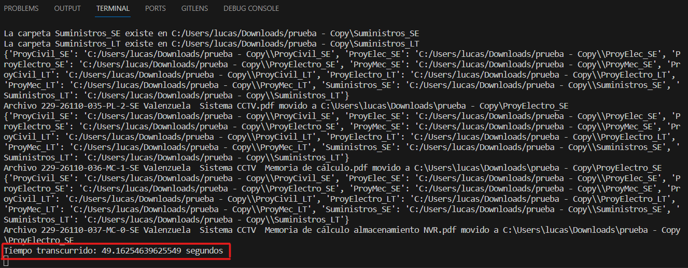
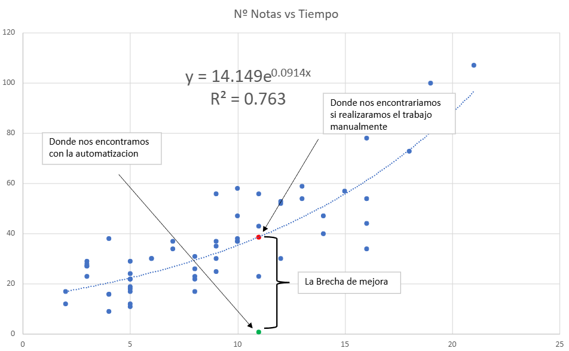

# L1_cmix - Automatización Documental en Python
## Sobre el Proyecto
Este proyecto nace de una necesidad real: reducir las tareas administrativas repetitivas en la gestión de notas de comunicación dentro de un proyecto de construcción eléctrica a gran escala.
Lo desarrollé durante mi participación en el curso "100 Days of Code: The Complete Python Pro Bootcamp", como una aplicación práctica de lo aprendido.

El sistema automatiza la extracción de datos desde documentos escaneados (PDF), los organiza en planillas Excel y distribuye los archivos en carpetas según su contenido.
Logró una mejora del 97.88% en eficiencia frente al proceso manual.

## ¿Por qué se llama L1_cmix?
El nombre surge de una historia interna del trabajo. En la empresa ConcretMix, donde implementé esta herramienta, había dos personas llamadas Lucas. Como fui el primero en llegar, me apodaron Lucas Uno.
Así nació el nombre del repositorio:

- L1 = Lucas Uno

- cmix = ConcretMix

## Capturas del Proceso

A continuación algunas imágenes que ilustran el funcionamiento del sistema y el impacto del proceso automatizado:

| Imagen | Descripcion |
|-------|-------------|
| | Interfaz gráfica del programa |
|  | Nota escaneada con tabla target |
|  | Terminal mostrando procesamiento de archivos |

## ⚠️ Sobre su Uso y Limitaciones
Este proyecto no fue diseñado para ser reutilizable por terceros. Fue una solución rápida para un problema específico, en el marco de aprendizaje y aplicación inmediata.

Limitaciones actuales:

- No usa programación orientada a objetos (OOP)

- No incluye archivo requirements.txt

- No tiene pruebas automatizadas

- No fue pensado para portabilidad o despliegue en otros entornos

> Lo conservo como evidencia de lo aprendido y de cómo la programación puede generar impacto tangible en entornos laborales reales.

## Resultados

| Indicador                 | Resultado |
| ------------------------- | --------- |
| Documentos procesados     | 11        |
| Tiempo estimado manual    | 38.67 min |
| Tiempo con automatización | 0.82 min  |
| Eficiencia lograda        | 97.88%    |

### Comparacion de tiempo entre tarea Manual y Automatica

## Tecnologías y Librerías Usadas
- Python ≥ 3.8

- Bibliotecas:
 
  - tkinter, os, pathlib, glob, re

  - tabula, pytesseract, pdf2image

  - datetime, pandas, openpyxl, shutil

  - otras estándar del ecosistema Python

## Autor
- Lucas Acosta

- Estudiante de Ingeniería Industrial

- Curso: [100 Days of Code](ude.my/UC-2812c6d5-4da7-421f-8051-451be99e29eb)

## Licencia
Este proyecto está bajo la Licencia MIT. Podés consultar los términos completos en el archivo LICENSE.
