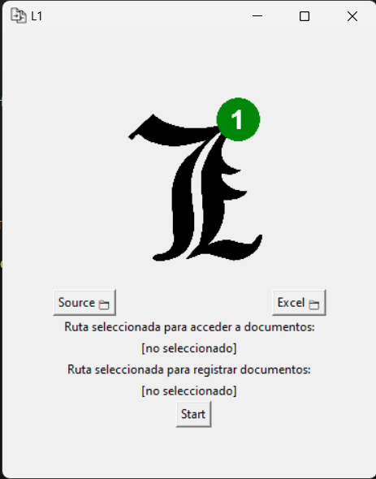
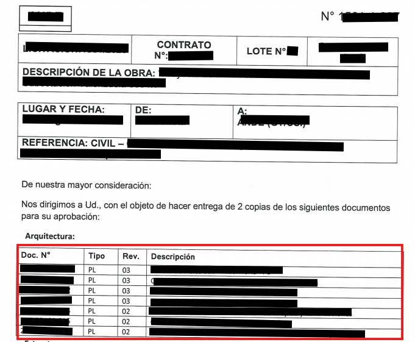

# L1_cmix  — Document Automation Project in Python

> 🇪🇸 **This README is also available in Spanish:** [README-ES.md](./README-ES.md)

## About the Project

This project was born out of a real need: to reduce repetitive administrative tasks in handling communication notes within a large-scale electrical construction project.  
I developed it during the course _"100 Days of Code: The Complete Python Pro Bootcamp"_ as a practical application of the skills I was learning.

The system automates data extraction from scanned documents (PDF), organizes the results into Excel spreadsheets, and distributes the files into folders based on their content.  
It achieved a **97.88% efficiency improvement** compared to the manual process.

## About the Repository Name

The name `L1_cmix` has personal and professional origins.  
At **ConcretMix**, the company where this tool was implemented, there were two people named Lucas. Since I joined first, they nicknamed me **Lucas One**.  
Hence the name:
- `L1` = Lucas One  
- `cmix` = ConcretMix

Just a small story behind the name.

## Screenshots

Here are some images to illustrate the workflow and the impact of the automated process:

| Image | Description |
|-------|-------------|
| | GUI of the program |
|  | Scanned note with referenced documents |
|  | Terminal showing file processing |

## About Reproducibility

This project was **not intended to be reused by others**. It was a quick solution for a specific problem, developed in a learning context and applied immediately in a real work setting.

Known limitations:
-  No object-oriented programming (OOP)
-  No `requirements.txt` for dependencies
-  No automated testing
-  Not designed for portability across environments

> This repository stands as a record of learning, practical impact, and how code can solve industrial engineering problems.

## Results

| Metric | Value |
|--------|-------|
| Documents processed | 11 |
| Estimated manual time | 38.67 min |
| Automated time | 0.82 min |
| Efficiency improvement | 97.88% |

### Manual vs automated time comparison

## Technologies and Libraries

- **Python ≥ 3.8**
- Libraries used:
  - `tkinter`, `os`, `pathlib`, `glob`, `re`
  - `tabula`, `pytesseract`, `pdf2image`
  - `datetime`, `pandas`, `openpyxl`, `shutil`
  - and other standard modules in the Python ecosystem

##  Author

**Lucas Acosta**  
Industrial Engineering Student   
Course: [_100 Days of Code_](https://ude.my/UC-2812c6d5-4da7-421f-8051-451be99e29eb)

## License

This project is licensed under the MIT License. See the `LICENSE` file for full details.

